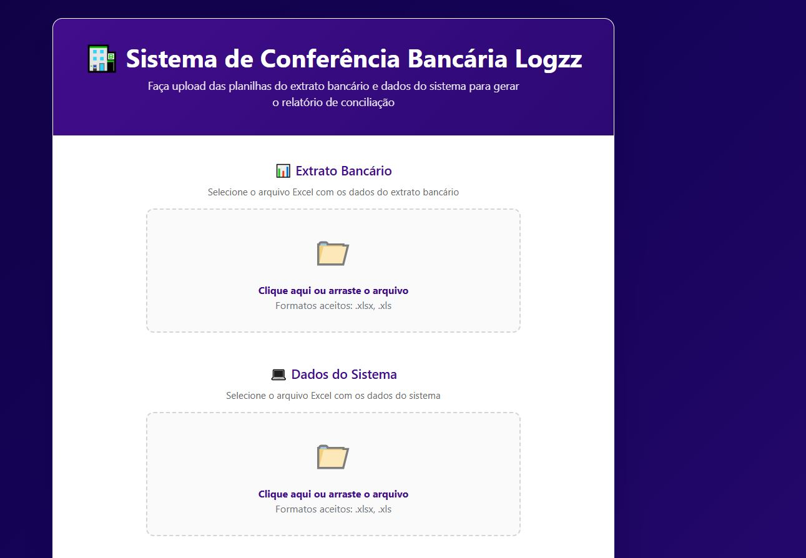

# 🏦 Bank Reconciliation System

A full-stack web application for automated bank reconciliation, comparing bank statements with system data and generating detailed reconciliation reports.





## 🌟 Features

- 📊 **Excel File Processing**: Upload and process bank statements and system data in Excel format
- 🔄 **Automated Reconciliation**: Automatically match transactions between bank statements and system records
- 📈 **Detailed Reports**: Generate comprehensive reconciliation reports with discrepancies highlighted
- 🎯 **User-Friendly Interface**: Clean and intuitive React-based interface
- ☁️ **Cloud Deployed**: Backend on Vercel, Frontend on Netlify
- 🚀 **Fast Processing**: Efficient algorithms for large dataset handling

## 🔗 Live Demo

- **Frontend**: [https://conciliacaologzz.netlify.app/](https://conciliacaologzz.netlify.app/)
- **Backend API**: [https://conciliacaobancaria.vercel.app](https://conciliacaobancaria.vercel.app)

## 🛠️ Tech Stack

### Frontend
- **React** 19.1.1
- **Vite** 7.1.7
- **Axios** 1.12.2
- **CSS3** for styling

### Backend
- **Node.js** ≥18.x
- **Express** 4.18.2
- **Multer** for file uploads
- **XLSX** 0.18.5 for Excel processing
- **Lodash** 4.17.21 for data manipulation
- **Moment-timezone** 0.5.43 for date handling

## 📁 Project Structure
```
conciliacaobancaria/
├── backend/
│   ├── src/
│   │   ├── api.js                 # Express server
│   │   └── services/
│   │       ├── ExcelService.js    # Excel reading/writing
│   │       ├── ConciliacaoService.js  # Reconciliation logic
│   │       └── RelatorioService.js    # Report generation
│   ├── package.json
│   └── vercel.json
├── frontend/
│   ├── src/
│   │   ├── App.jsx                # Main component
│   │   ├── components/
│   │   │   ├── FileUpload.jsx
│   │   │   └── ProcessingStatus.jsx
│   │   └── App.css
│   ├── package.json
│   ├── netlify.toml
│   └── .env.production
└── README.md
```

## 🚀 Getting Started

### Prerequisites

- Node.js ≥18.x
- npm or yarn
- Git

### Local Development

#### 1. Clone the repository
```bash
git clone https://github.com/ojosealbertoalves/conciliacaobancaria.git
cd conciliacaobancaria
```

#### 2. Setup Backend
```bash
cd backend
npm install
npm start
```

The API will run on `http://localhost:3001`

#### 3. Setup Frontend
```bash
cd ../frontend
npm install
npm run dev
```

The app will run on `http://localhost:5173`

#### 4. Test the API

Visit: `http://localhost:3001/api/test`

Expected response:
```json
{
  "message": "API funcionando!",
  "timestamp": "2025-11-10T12:32:14.028Z"
}
```

## 📊 API Endpoints

### Health Check
```
GET /api/test
```

Returns API status and timestamp.

### Process Reconciliation
```
POST /api/conciliar
Content-Type: multipart/form-data

Body:
- extrato: Excel file (bank statement)
- sistema: Excel file (system data)
```

Returns: Excel file with reconciliation report

## 📤 Deployment

### Backend (Vercel)

1. Push code to GitHub
2. Import project on [Vercel](https://vercel.com)
3. Set **Root Directory**: `backend`
4. Deploy

### Frontend (Netlify)

1. Import project on [Netlify](https://netlify.com)
2. Set **Base directory**: `frontend`
3. Set **Build command**: `npm run build`
4. Set **Publish directory**: `frontend/dist`
5. Deploy

## 🔧 Environment Variables

### Frontend (.env.production)
```env
VITE_API_URL=https://your-backend-url.vercel.app
```

### Backend
```env
NODE_ENV=production
PORT=3001
```

## 📝 Excel File Format

### Bank Statement (extrato_banco.xlsx)
Required columns:
- Date
- Description
- Amount
- Balance

### System Data (dados_sistema.xlsx)
Required columns:
- Date
- Description
- Amount
- Reference

## 🧪 Testing

### Backend Tests
```bash
cd backend
npm test
```

### Frontend Tests
```bash
cd frontend
npm run test
```

## 🤝 Contributing

Contributions are welcome! Please follow these steps:

1. Fork the repository
2. Create a feature branch (`git checkout -b feature/AmazingFeature`)
3. Commit your changes (`git commit -m 'Add some AmazingFeature'`)
4. Push to the branch (`git push origin feature/AmazingFeature`)
5. Open a Pull Request

## 📋 Roadmap

- [ ] Add user authentication
- [ ] Support for multiple file formats (CSV, PDF)
- [ ] Advanced filtering and search
- [ ] Export reports in multiple formats
- [ ] Dashboard with analytics
- [ ] Multi-language support

## ⚠️ Known Issues

- Large files (>10MB) may take longer to process
- Excel files must be in .xlsx or .xls format

## 📄 License

This project is licensed under the MIT License - see the [LICENSE](LICENSE) file for details.

## 👤 Author

**José Alberto Alves**

- GitHub: [@ojosealbertoalves](https://github.com/ojosealbertoalves)

## 🙏 Acknowledgments

- Logzz for the project requirements
- Anthropic Claude for development assistance
- Open source community for the amazing libraries

## 📞 Support

For support, email your-email@example.com or open an issue in this repository.

---

⭐ If you find this project useful, please consider giving it a star!